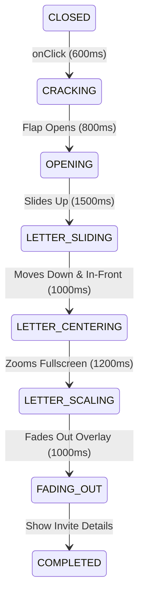

# Technical Design — Cinematic Envelope Animation Fix

## Architectural Decisions

### State Pipeline Updates
We expand the phased states in `EnvelopeWrapper.tsx` and `CreatorCanvas.tsx` to insert `'LETTER_CENTERING'` between `'LETTER_SLIDING'` and `'LETTER_SCALING'`.

### Element Hand-Off and Z-Indexing
- The pocket letter is contained within `.envelope-pocket-clipper` (which has `overflow: hidden`). It is hidden (`opacity: 0` / not rendered) once the phase leaves `'LETTER_SLIDING'`.
- The viewport overlay `.envelope-letter-viewport-overlay` is rendered as `position: fixed` with a `z-index` of `9999`. It is visible during `'LETTER_CENTERING'`, `'LETTER_SCALING'`, and `'FADING_OUT'`.
- To avoid any sudden layout shifts or visual jumps when switching from the pocket letter to the viewport overlay:
  - Both elements will render identical content via `renderLetterContent()`.
  - The viewport overlay will match the initial size, padding, border-radius, background, and borders of the pocket card.
  - In `'LETTER_CENTERING'`, the viewport overlay is given the class `state-centering`, which triggers a keyframe animation shifting it from the pocket's top position (`translate(-50%, -80%)`) down to the screen center (`translate(-50%, -50%)`).

---

## Risks & Mitigations

### 1. Element Size or Font Mismatches (Flicker/Jump)
- **Risk**: If the text blocks or card size are slightly different between the pocket letter and the fixed viewport overlay, there will be a visible flicker during hand-off.
- **Mitigation**: Standardize the CSS styling (e.g. padding, width, height, border, background) for both `.envelope-couple-photo` and `.envelope-letter-viewport-overlay` at the transition start. Any scaling or padding increases will only happen after the `'LETTER_CENTERING'` phase is complete (during `'LETTER_SCALING'`).

### 2. Viewport Overlay Positioning
- **Risk**: Since the viewport overlay is `position: fixed; top: 50%; left: 50%`, it assumes the envelope container is roughly centered on the screen. If the user scrolls, the hand-off might mismatch.
- **Mitigation**: During the opening animation sequence, the page scrolling container `.recipient-scroll-container` has `overflow-y: hidden` applied to prevent user scrolling until the animation is fully `'COMPLETED'`. This keeps the envelope container centered on the screen.
