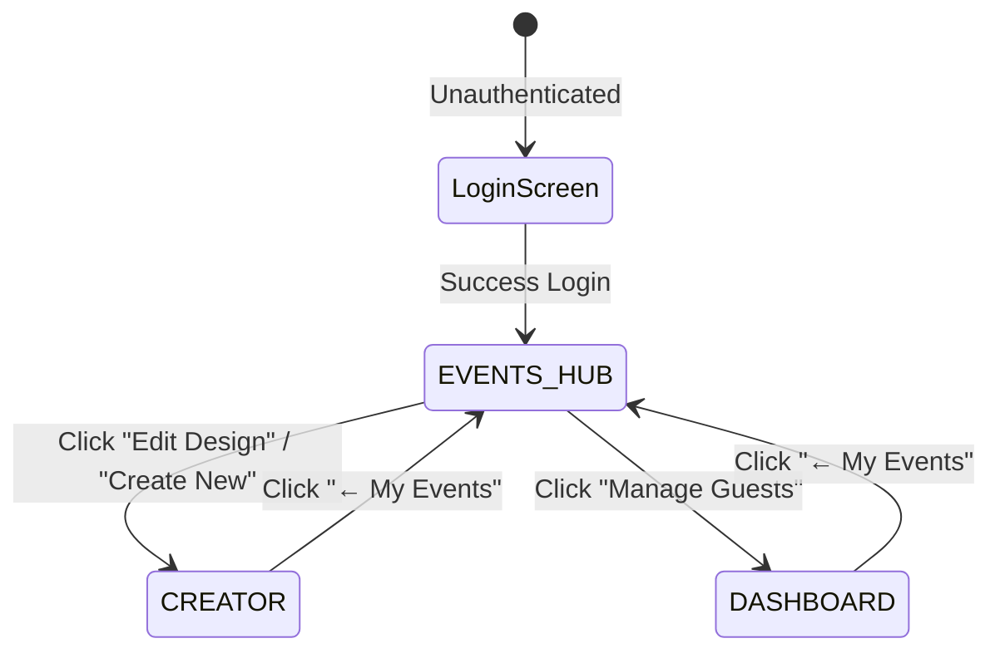

# Design — Event Management Hub

## Architectural Decisions

### Decision 1: AppMode Extension
**Choice**: Extend the existing `AppMode` enum/union in [sigil.types.ts](file:///home/fenix3819/sigil-and-script/src/types/sigil.types.ts) with `'EVENTS_HUB'`.
**Why**:
- Integrating the Landing Hub as a first-class app mode avoids creating separate routing variables.
- Adapts naturally to our existing component dispatcher inside `App.tsx`.

### Decision 2: Isolated Canvas Creation State
**Choice**: Reset state to `DEFAULT_DESIGN` and clear the ID during "Create New Event" execution.
**Why**:
- Ensures a newly created event does not carry over custom uploaded assets (like headers or envelopes) from the last loaded invitation.
- The server will automatically generate a fresh, unique database ID when the new canvas is saved.

### Decision 3: Guest Roster Cleaning on Event Switch
**Choice**: Update the canvas load hook to automatically load the specific guests mapped to that canvas.
**Why**:
- If guest lists are loaded in the background, we must ensure they are scoped to the active event.
- When `loadDesign` executes, it will fetch the canvas details and load the target invitation's guest list.

---

## State Flow Transitions

