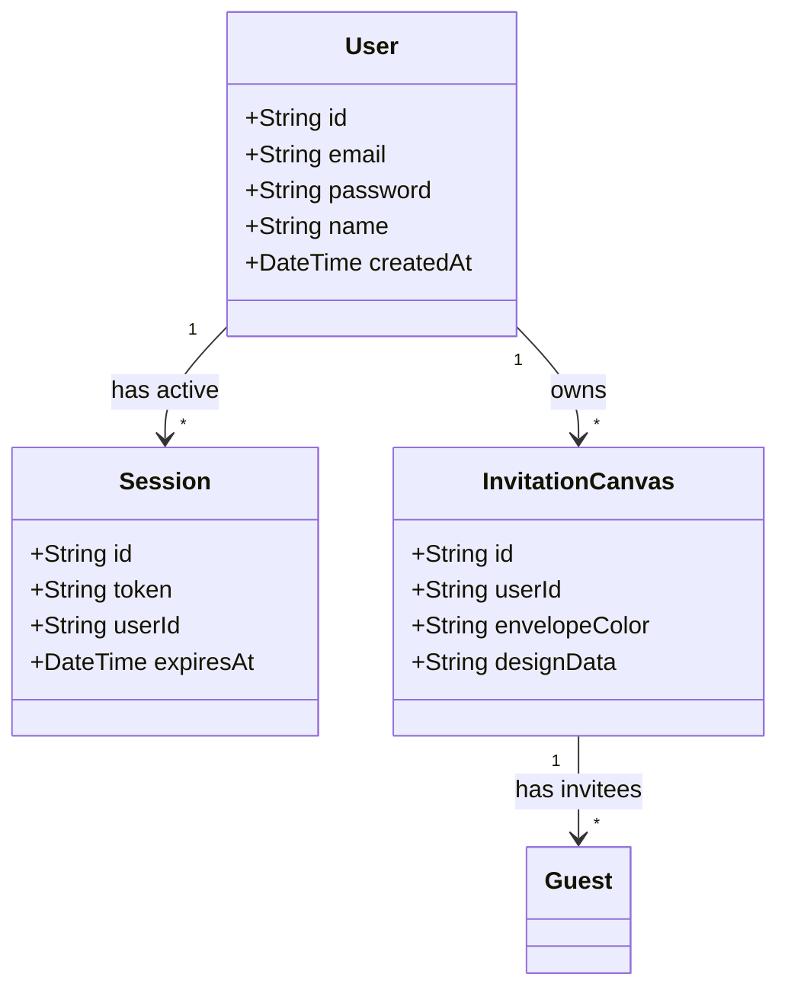

# Design — User Authentication and Ownership

## Architectural Decisions

### Decision 1: Zero-Dependency Password Hashing
**Choice**: Use Node's built-in `crypto` module for salt-based password hashing.
**Why**:
- Using `crypto.pbkdf2Sync` or `crypto.scryptSync` avoids importing external hashing libraries like `bcrypt` or `bcryptjs`. This prevents potential package validation issues and builds faster on serverless platforms.
- We will generate a unique 16-byte random salt for each user, perform 10,000 iterations of PBKDF2 (SHA-512), and store the salt and hash together.

### Decision 2: Database-Backed Session Management
**Choice**: Generate random 64-byte token keys stored in a `Session` table rather than client-signed JWTs.
**Why**:
- Session tokens (`crypto.randomBytes(64).toString('hex')`) stored in the database provide clean logout handling: deleting the session record instantly revokes access.
- Avoids setting up JWT signature secrets and avoids token validation drift between server instances.

### Decision 3: Backwards Compatibility for Canvases
**Choice**: Configure `userId String?` (nullable) on the `InvitationCanvas` schema.
**Why**:
- If `userId` was non-nullable, pushing the schema would fail due to foreign key violations on any pre-existing canvas rows. Setting it as optional allows existing rows to remain intact; new rows will automatically assign the authenticated user's ID.

---

## Data Models

