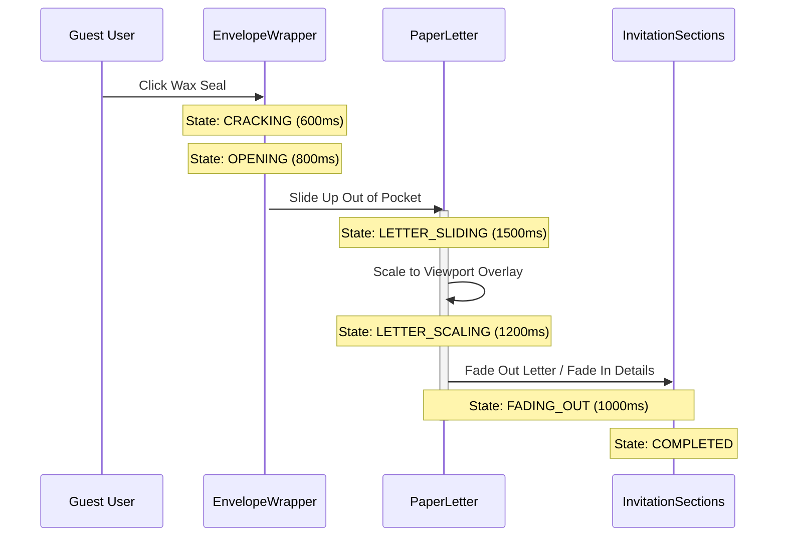

# Design — Cinematic Envelope Transition

## Architectural Decisions

### Decision 1: Viewport Overlay for Scaling Phase
**Choice**: During the `'LETTER_SCALING'` and `'FADING_OUT'` phases, the paper letter component transitions to a fixed position overlay (`position: fixed; inset: 0; z-index: 9999`) with smooth transition metrics (`transform: scale(...)`, `opacity: ...`).
**Why**:
- If the letter remained inside the pocket container (`.envelope-pocket-clipper` which has `overflow: hidden`), scaling it up would cause it to be clipped by its parents' boundaries.
- Using a fixed viewport-level overlay guarantees the letter can seamlessly grow to cover the entire browser screen.

### Decision 2: Sequential Animation Timings
**Choice**: Coordinate phase transitions using JavaScript-orchestrated timeouts matching the CSS animation durations:
- `CLOSED` (Wait for click)
- `CRACKING`: 600ms (Seal shakes/cracks, audio crack plays)
- `OPENING`: 800ms (Flap swings up, opened envelope layers reveal)
- `LETTER_SLIDING`: 1500ms (Letter rises out of pocket, centering on screen)
- `LETTER_SCALING`: 1200ms (Letter scales to fill 100vw/100vh)
- `FADING_OUT`: 1000ms (Letter opacity transitions to 0, invitation container opacity transitions to 1)
- `COMPLETED` (Animation state clears, guest can scroll invitation sections normally)

### Decision 3: Event Logo Position
**Choice**: Move the uploaded `openedEnvelopeImage` asset to render as the first element inside the main invitation layout card (at the top of the details sections).
**Why**:
- Keeps the monogram or couple photo prominent.
- Relocates it to a natural, high-visibility branding location.

---

## State Transition Timeline

